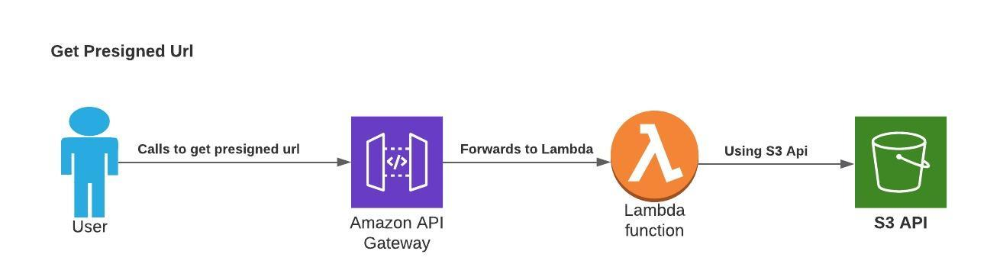

# S3 Presigned Url

This code repository is for the following tutorial:
https://mycloudtutorials.com/2021/04/create-amazon-s3-presigned-url-using-serverless-framework-and-nodejs/

The Youtube video: https://www.youtube.com/watch?v=JDwpJI_Tiqs

 
My Blog: https://mycloudtutorials.com/

LinkedIn: https://www.linkedin.com/in/girishjaju/

# Installtion instructions

1. Make sure you have serverless, node and npm installed.
2. Clone/download the repository

    2a) I have added a plugin called serverless-plugin-log-retention (after the youtube video recording), to be able to specify CloudWatch log retention duration. By default, the logs are retained for unlimited time.
    
    2b) After downloading the source code, please run npm install, before running the sls deploy

3. Open the serverless.yml file and replace the S3 bucket name in the resources section
4. Run sls deploy
5. Get the api end point
6. User postman / curl to send the post request to the api end point, with payload like:

        a) For GetObject
        {
            "objectKey": "sample1.html",
            "s3Action": "getObject"
        }

        b) For PutObject
        {
            "objectKey": "sample1.html",
            "s3Action": "putObject",
            "contentType": "text/html"
        }

7. Once you have the presignedUrl for GetObject, you can paste in the browser to view / download the file

8. For PutObject, you can use a sample curl command to upload the file to S3 bucket. 
For example:
    curl -k -H "Content-Type: text/html" -X PUT -T "sample1.html" "PRESIGN URL"

# The architecure / flow diagram:

